# SecBrain Visual Codemap

This document provides visual representations of the SecBrain codebase structure.

## Module Dependency Graph

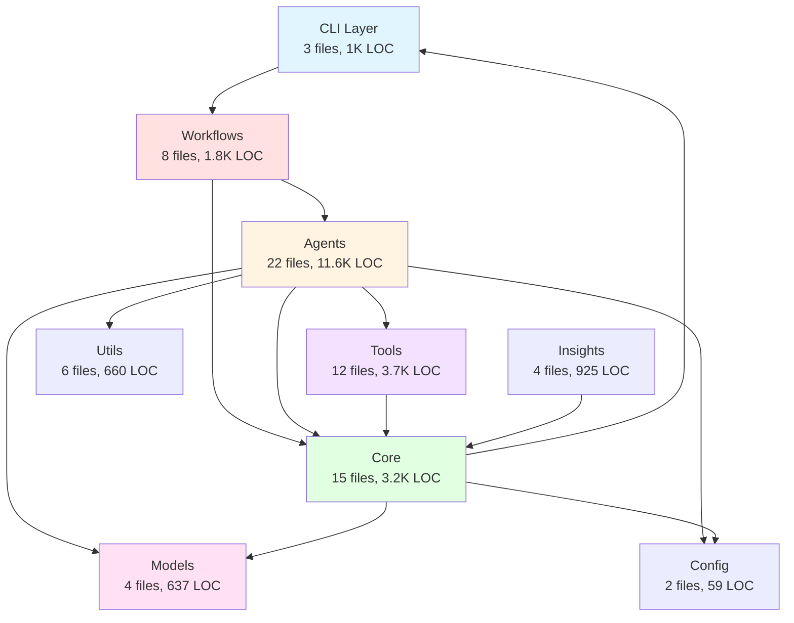

## Agent Ecosystem

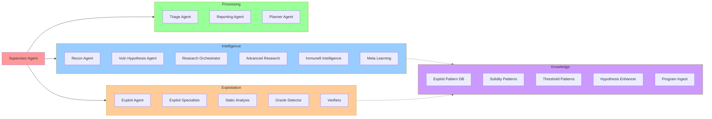

## Workflow State Machine

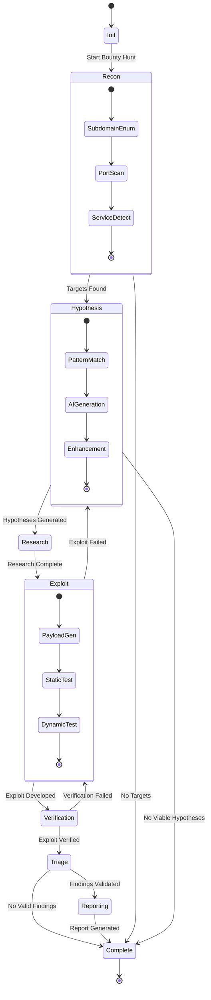

## Data Flow Architecture

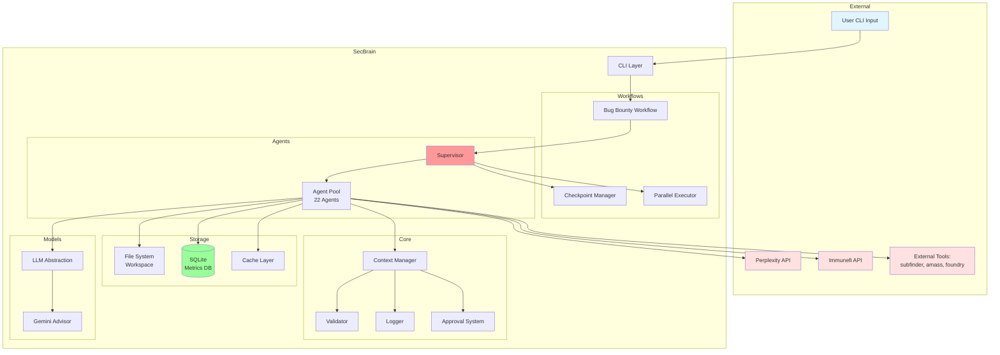

## Component Interaction Sequence

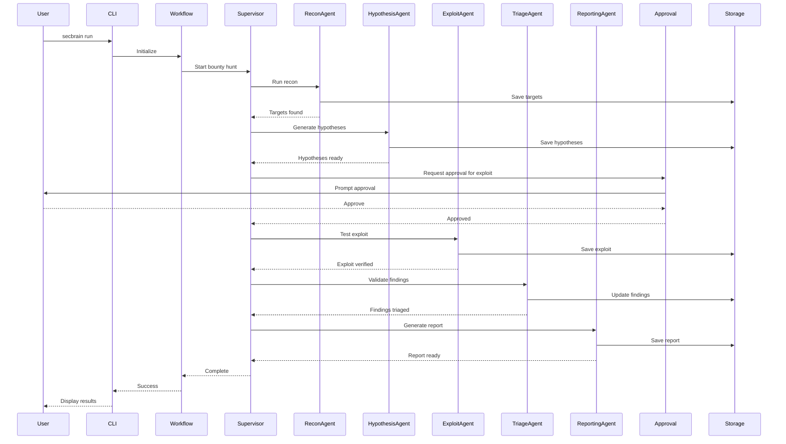

## Module Size Distribution

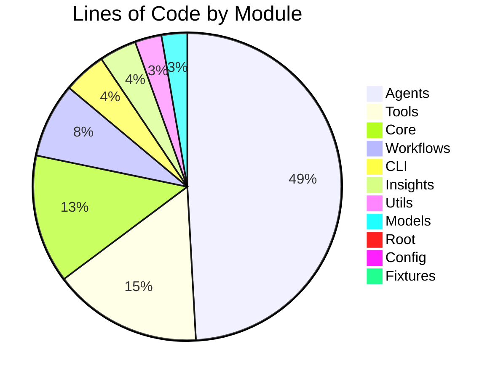

## Async vs Sync Functions

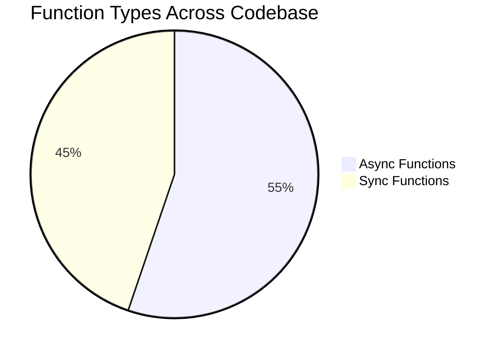

## File Size Distribution

```mermaid
graph LR
    subgraph Large Files >400 LOC
        A1[Agents: 527 avg]
        A2[CLI: 353 avg]
    end
    
    subgraph Medium Files 200-400 LOC
        M1[Tools: 308 avg]
        M2[Workflows: 231 avg]
        M3[Insights: 231 avg]
        M4[Core: 212 avg]
    end
    
    subgraph Small Files <200 LOC
        S1[Models: 159 avg]
        S2[Utils: 110 avg]
        S3[Root: 107 avg]
        S4[Config: 29 avg]
        S5[Fixtures: 10 avg]
    end
    
    style A1 fill:#ff9999
    style A2 fill:#ff9999
    style M1 fill:#ffcc99
    style M2 fill:#ffcc99
    style M3 fill:#ffcc99
    style M4 fill:#ffcc99
    style S1 fill:#99ff99
    style S2 fill:#99ff99
    style S3 fill:#99ff99
    style S4 fill:#99ff99
    style S5 fill:#99ff99
```

## Agent Specialization Tree

```mermaid
graph TD
    BASE[Base Agent<br/>Abstract Class]
    
    BASE --> SUPER[Supervisor Agent<br/>Orchestration]
    BASE --> INFO[Information Gathering]
    BASE --> ANALYSIS[Analysis]
    BASE --> EXPLOIT[Exploitation]
    BASE --> REPORTING[Reporting]
    
    INFO --> RECON[Recon Agent]
    INFO --> INGEST[Program Ingest]
    INFO --> IMMUNEFI[Immunefi Intelligence]
    
    ANALYSIS --> HYPOTHESIS[Vuln Hypothesis]
    ANALYSIS --> STATIC[Static Analysis]
    ANALYSIS --> RESEARCH[Research Orchestrator]
    ANALYSIS --> ADVANCED[Advanced Research]
    ANALYSIS --> META[Meta Learning]
    
    EXPLOIT --> EXP[Exploit Agent]
    EXPLOIT --> SPEC[Exploit Specialists]
    EXPLOIT --> ORACLE[Oracle Detector]
    EXPLOIT --> VERIFY[Verifiers]
    
    REPORTING --> TRIAGE[Triage Agent]
    REPORTING --> REP[Reporting Agent]
    REPORTING --> PLAN[Planner Agent]
    
    style BASE fill:#cc99ff
    style SUPER fill:#ff9999
    style INFO fill:#99ccff
    style ANALYSIS fill:#ffcc99
    style EXPLOIT fill:#ff9999
    style REPORTING fill:#99ff99
```

## Tool Integration Map

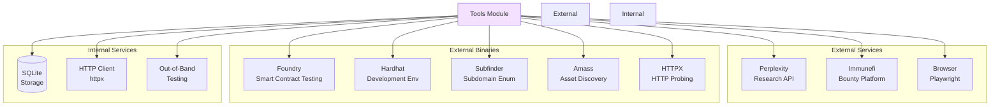

## Security Control Flow

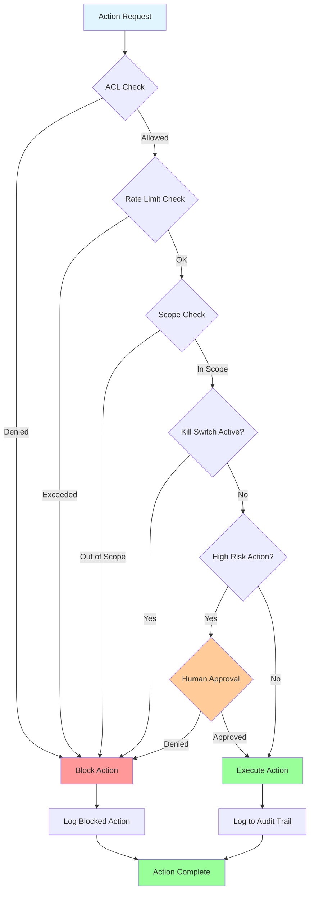

## Workspace Structure

```
workspace/
├── 📁 recon/
│   ├── domains.txt                # Discovered domains
│   ├── targets.json               # Target endpoints
│   ├── subdomains.txt            # Subdomain enumeration
│   └── services.json             # Service fingerprints
│
├── 📁 hypotheses/
│   ├── hypotheses.json           # Vulnerability hypotheses
│   ├── enhanced/                 # Enhanced hypotheses
│   └── research/                 # Research context
│
├── 📁 exploits/
│   ├── exploit_001.sol           # Solidity exploits
│   ├── exploit_002.py            # Python exploits
│   ├── results/                  # Test results
│   └── artifacts/                # Build artifacts
│
├── 📁 findings/
│   ├── findings.json             # Validated findings
│   ├── verified/                 # Verified exploits
│   └── false_positives/          # FP analysis
│
├── 📁 logs/
│   ├── audit.jsonl               # Audit trail
│   ├── debug.log                 # Debug logs
│   ├── errors.log                # Error logs
│   └── performance.jsonl         # Performance metrics
│
├── 📁 reports/
│   ├── final_report.md           # Final report
│   ├── executive_summary.pdf     # Executive summary
│   └── insights_dashboard.html   # Insights dashboard
│
├── 📁 phases/
│   ├── recon.json                # Recon phase state
│   ├── hypothesis.json           # Hypothesis phase state
│   ├── exploit.json              # Exploit phase state
│   └── triage.json               # Triage phase state
│
└── 📁 learnings/
    ├── patterns.json             # Learned patterns
    ├── metrics.json              # Success metrics
    └── feedback.json             # User feedback
```

## Technology Stack

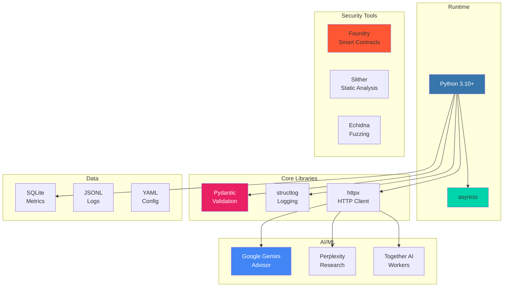

---

*These visual representations complement the detailed [CODEMAP_ANALYSIS.md](../CODEMAP_ANALYSIS.md) document.*
